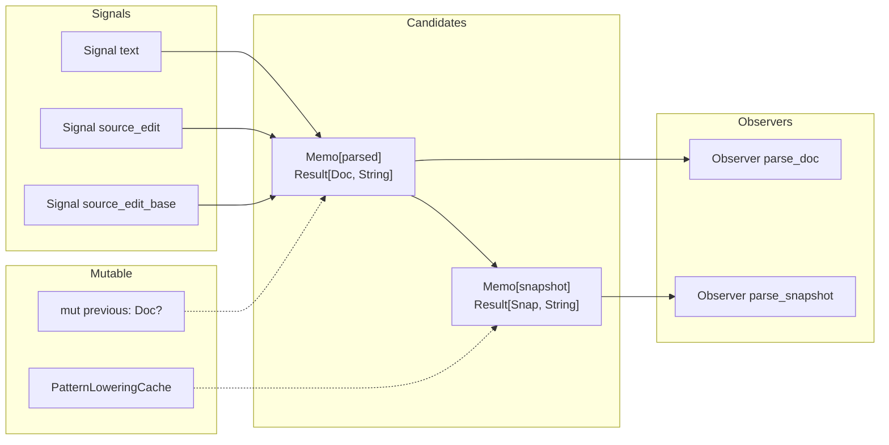
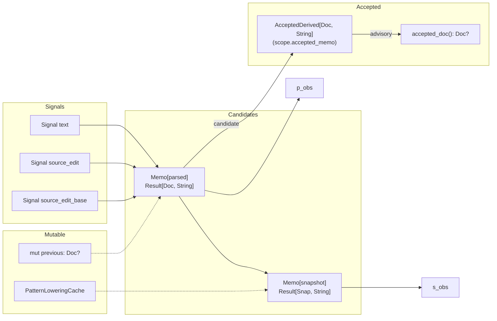

# Mini authoring `AcceptedDerived` migration

**Status:** Proposed  
**Date:** 2026-07-07  
**Campaign parent:** #184 (mini authoring loom promotion)  
**Depends on:** incr `#233` (diamond fix) — already in incr `0.9.0` (current pin)

---

## Executive summary

**Recommendation: Case A — minimum invasiveness (`AcceptedDerived` only, hand-written parser stays).**

`MiniAuthoringPipeline`'s `mut previous` is two responsibilities coupled. PR1 extracts last-good into `AcceptedDerived`, keeping ID reuse in the hand-written parser. This is ~3 files changed, zero new dependencies, zero parser changes, and passes all existing tests.

**Value thesis: this PR is a rehearsal, not a feature.** No caller is waiting for `accepted_doc()` — the value is proving `AcceptedDerived` wiring on a simple path before #184 Phase 4 (loom authoring swap) depends on it. If loom swap does not use `AcceptedDerived`, this PR is YAGNI and should be reverted.

---

## 1. Current architecture

```text
Signal[text] ──┐
Signal[edit] ───┤
                v
        Memo[parsed candidate]   ──→ Observer[Result[Doc, String]]
                │                     ↑ parse_doc()
                │  mut previous
                │  (last Ok Doc,
                │   UNCHANGED on Err)
                v
        Memo[snapshot candidate] ──→ Observer[Result[Snap, String]]
                                      ↑ parse_snapshot()
```



Key: `parsed` memo reads `prev` on every recompute to pass as `previous` to `parse_doc_with_token_identities`. On `Ok`, it sets `prev = Some(doc)`. On `Err`, `prev` is untouched. This is two concerns in one mutable cell.

---

## 2. Target architecture (Case A)

```text
Signal[text] ──┐
Signal[edit] ───┤
                v
        Memo[parsed candidate]   ──→ Observer[Result[Doc, String]]
                │                     ↑ parse_doc() — current channel
     ┌──────────┤
     v          │
AcceptedDerived │
  (BackdateEq)  │
     │          │
     v          v
  accepted    id-reuse
  channel     previous (Kept inside
  (advisory)  candidate only)
```



Changes:
- `mut previous` stays inside the candidate memo for **ID reuse only** — it's still needed by `parse_doc_with_token_identities(..., previous=Some(...))`.
- A new `AcceptedDerived[PatternDoc, String]` (BackdateEq tier via `scope.accepted_memo`) wraps `parsed.get()` as its candidate.
- `accepted_doc()` exposes the last-good doc as `PatternDoc?`.
- `parse_doc()` stays the current channel (same `Observer`).
- `parse_snapshot()` stays unchanged — it reads from `parsed` (current channel).

---

## 3. Public API diff

| Symbol | Current | After change | Breaking? | Compatibility |
|--------|---------|-------------|-----------|---------------|
| `MiniAuthoringPipeline::parse_doc()` | current channel `Result[Doc, String]` | **unchanged** — still current channel | No | Callers see no change |
| `MiniAuthoringPipeline::parse_snapshot()` | current channel `Result[Snap, String]` | **unchanged** | No | Callers see no change |
| `MiniAuthoringPipeline::accepted_doc()` | **new** | `PatternDoc?` — last-good or `None` | New API | Callers opt in |
| `MiniAuthoringPipeline::new()` | takes `input: String` | **unchanged** | No | — |
| Compute counters | parse_compute/snapshot_compute | **unchanged** semantics | No | — |
| `parse_doc()` after parse error | `Err`, but `previous` unchanged | `Err`, last-good available via `accepted_doc()` | Semantically extended | Compatible: old API still works |

### Key semantic note

`parse_doc()` still returns `Err` on parse failure — callers that only read the current channel see exactly the same behavior. The accepted channel is additive. The "last-good" query was previously invisible (only the next `set_input` + successful parse would see it via ID reuse); now it's first-class.

---

## 4. File change list

| Path | Operation | Summary | Dependencies |
|------|-----------|---------|-------------|
| `mini/incr_authoring.mbt` | Modify | Add `AcceptedDerived` field, wire `scope.accepted_memo()`, add `accepted_doc()` method. `mut previous` stays in candidate for ID reuse. | `mini/moon.pkg` (no change needed — already imports full `@incr`) |
| `mini/mini_test.mbt` | Modify | Add tests for `accepted_doc()` channel. Existing tests: all pass unchanged. | Tests in same file |
| `docs/decisions/0017-mini-authoring-accepted-derived.md` | Add | New ADR for `AcceptedDerived` adoption in authoring path | Cross-references ADR-0011, ADR-0013 |
| `CHANGELOG.md` | Modify | Add `MiniAuthoringPipeline::accepted_doc()` under [Added] | — |
| `scripts/check-incr-import-boundaries.sh` | (None) | No change — `mini/` already on the full-facade carve-out list (ADR-0011) | — |
| `moon.mod` | (None) | No change — incr `0.9.0` already has `AcceptedDerived.accepted_memo` + `Scope::accepted_memo` | — |

---

## 5. `mut previous` dismantling plan

**Last-good → `AcceptedDerived`:**

```moonbit
// In MiniAuthoringPipeline::new(...):
// AFTER the `parsed` memo is constructed:
let parsed_accepted = scope.accepted_memo(
  () => parsed.get(),
  label="mini.accepted_doc",
)
```

This creates a `BackdateEq`-tier `AcceptedDerived` whose candidate is the parsed memo's current value. `backdate_equal(PatternDoc)` uses full revision identity (value + fingerprint) — the same predicate the spike proved correct.

**ID reuse — stays in candidate:**

`mut previous` remains in the parsed candidate memo body. It is only read by `parse_doc_with_token_identities(..., previous=Some(prev))`. On `Ok`, `previous = Some(doc)`. On `Err`, untouched. This is the ID reuse concern ONLY — the last-good concern is now served by `AcceptedDerived`.

**Ownership:**

```text
candidate memo           AcceptedDerived          mut previous
─────────────            ───────────────          ───────────
stores previous          stores accepted          inside candidate
for ID reuse             (via incr slot)          body only
                         read-only advisory
```

`source_edit` / `source_edit_base` / token realignment — no change. The `source_edit_base.set(current)` on successful parse still happens inside the candidate body.

---

## 6. Test plan

### Existing tests — all pass unchanged

All `MiniAuthoringPipeline` tests exercise the current channel (`parse_doc()` / `parse_snapshot()`). No change to any assertion:

| Test | Behavior | Passes? |
|------|----------|---------|
| `"reuses stable ids and lowering cache across text edits"` | current channel ID stability | Yes, unchanged |
| `"keeps last reusable doc after parse error"` | current channel `Err` + recovery | **Yes** — this test's assertions are about the **current** channel returning `Err` and recovering IDs. It passes unchanged. |
| `"exposes whole-document recomputation counts"` | compute counter behavior | Yes |
| `"token replacement reuses unaffected lowered subtrees"` | cache hit/miss assertion | Yes |
| `"tracks internal authoring token count"` | token counting | Yes |
| All `"source edit preserves..."` tests | provenance assertions | Yes |
| `"accepts Strudel-style dollar stack lines"` | current channel | Yes |

### Key test: `"keeps last reusable doc after parse error"` (line 490)

This test:
1. `s("bd sd")` → success, get IDs
2. `s("bd sd"` → `Err`
3. Recover to `s("  bd   sd  ")`
4. Assert same IDs + lowering cache hit

**Under Case A: pass unchanged.** The test only reads `parse_doc()` and `parse_snapshot()` — the current channel. The `Err` return is unchanged. The recovery IDs come from `mut previous` inside the candidate, which is unchanged. The test never reads the accepted channel, so it doesn't exercise the new `accepted_doc()`.

But: this test **already validates** the last-good behavior implicitly — it proves that `parse_doc()` (current channel) returns `Err` but the next successful parse uses the old IDs. The new `accepted_doc()` exposes that last-good explicitly.

### New tests

From spike `last_good_test.mbt` (port to production):

```moonbit
// 1. accepted_doc retains last good across a parse error
let pipe = MiniAuthoringPipeline::new("s(\"bd sd\")")
let first = unwrap_doc(pipe.parse_doc()).revision()
assert_eq(pipe.accepted_doc().map(d => d.revision()), Some(first))
pipe.set_input("s(\"bd sd")  // malformed
assert(pipe.parse_doc() is Err(_))
assert_eq(pipe.accepted_doc().map(d => d.revision()), Some(first))
pipe.set_input("s(\"bd sd hh\")")  // recovery
let recovered = unwrap_doc(pipe.parse_doc()).revision()
// Collision premise: "bd sd" and "bd sd hh" share revision value but differ by fingerprint
assert_eq(recovered.value(), first.value())
assert_ne(recovered, first)
assert_eq(pipe.accepted_doc().map(d => d.revision()), Some(recovered))

// 2. accepted_doc is None before any successful parse
let pipe2 = MiniAuthoringPipeline::new("s(\"bd sd")
assert(pipe2.parse_doc() is Err(_))
assert_eq(pipe2.accepted_doc(), None)
```

**Revision fingerprint collision test** — ported from spike:

The spike test validates that `BackdateEq` compares by revision **identity** (value + fingerprint), not by revision **value** alone. This is critical because `"bd sd"` and `"bd sd hh"` can collide on revision value (both value=1) but differ by fingerprint. `backdate_equal` must catch this — otherwise a value-only predicate would wrongly treat a changed doc as unchanged and skip the accepted-channel advance.

Assertion template (from spike line 44-55):
```moonbit
// Pin the premise: collision on value, difference by fingerprint
assert_eq(recovered_rev.value(), first_rev.value())
assert_ne(recovered_rev, first_rev)
assert_eq(accepted_revision(pipe), Some(recovered_rev))
```

### Verification commands

```bash
NEW_MOON_MOD=0 moon check --deny-warn
NEW_MOON_MOD=0 moon test --release
./scripts/check-incr-import-boundaries.sh
./scripts/check-public-boundary.sh
```

---

## 7. Phase plan (PRs)

### PR0 — Design document only (this file)

**Files:** `docs/plans/2026-07-07-mini-authoring-accepted-derived-migration.md`  
**Status:** Proposed  

### PR1 — `AcceptedDerived` integration (core change)

**Title:** `feat(mini): add AcceptedDerived last-good channel to MiniAuthoringPipeline`  
**Scope:** `mini/incr_authoring.mbt`, `mini/mini_test.mbt`, `docs/decisions/ADR-0017`  
**Files changed:** 3-4

**Changes:**
1. Add `priv accepted : @incr.AcceptedDerived[PatternDoc[ControlMap], String]` field to struct
2. In `MiniAuthoringPipeline::new(...)`, after `parsed` memo construction:
   ```moonbit
   let accepted = scope.accepted_memo(
     () => parsed.get(),
     label="mini.accepted_doc",
   )
   // No extra add_cell_ids needed — Scope::accepted_memo allocates its own
   // child scope and registers the accepted cell internally. Matches spike.
3. Add `accepted_doc()` method:
   ```moonbit
   pub fn accepted_doc(self) -> PatternDoc[ControlMap]? {
     self.accepted.accepted_or_abort()
   }
   ```
4. Add new tests (port from spike + fingerprint collision)
5. New ADR-0017

**Rollback ease:** Trivial — revert one file. All existing behavior unchanged.  
**Completion criteria:**
- `moon check --deny-warn` passes
- All existing `MiniAuthoringPipeline` tests pass with zero changes
- New `accepted_doc()` tests pass
- Import boundaries pass (`mini/` already on full-facade carve-out list)
- ADR-0017 written

### PR2 — Documentation and CHANGELOG

**Title:** `docs: document AcceptedDerived adoption in mini authoring path`  
**Files:** `CHANGELOG.md`, ADR-0017 finalization  
**Rollback ease:** Docs only.

---

## 8. Risks and open questions

| Risk | Severity | Mitigation |
|------|----------|------------|
| **`parse_doc()` returns `Err` but `accepted_doc()` returns `Some(doc)`** — caller confusion about which channel to use | Medium | Document clearly: current vs accepted. The pattern is standard incr vocabulary. |
| **`AcceptedDerived` eager fold + dynamic diamond dependency** — incr #233 fix is in 0.9.0, which is already pinned. Verified by spike. | None | Already mitigated by pin. |
| **`accepted_doc()` returns `None` before first successful parse** (not `Err`) | Low | Correct per incr spec. Callers must handle `Option`. |
| **`BackdateEq` tier requires `PatternDoc : BackdateEq`** — already implemented (line 1259 of `pattern/pattern_doc.mbt`) | None | Already satisfied. |

### Open questions for design owner

1. **`accepted_doc()` return shape:** `PatternDoc?` (like spike) vs `Result[PatternDoc, NoAcceptError]` vs `PatternDoc` (abort if no accepted). Spike uses `?` (`accepted_or_abort` variant). Recommended: `PatternDoc?` — matches spike, explicit about pre-first-success state.

2. **`accepted_doc()` naming:** `accepted_doc()` mirrors the spike. Could also be `last_good_doc()` or `last_successful_doc()`. The incr vocabulary uses "accepted", so `accepted_doc()` is preferred for consistency.

3. **`accepted_changed_at()` exposure:** Should `MiniAuthorizingPipeline` expose the `AcceptedDerived`'s `accepted_changed_at()` revision timestamp? Defer — only needed if an editor asks "has the accepted doc changed since last check?"

4. **Observer for accepted channel:** `AcceptedDerived` has `watch_accepted`. Should `MiniAuthorizingPipeline` expose this? Probably not — callers who want to observe accepted changes can call `accepted_doc()` periodically. Wire it when an editor integration needs it.

5. **`PatternSnapshot` accepted channel:** Should there be an `accepted_snapshot()` too? No — snapshot lowering is cheap (cache hit after doc reuse), so the perf benefit of skipping it is negligible. The accepted doc is the value boundary.

**0. Does #184 Phase 4 plan to use `AcceptedDerived`?** — Yes means this PR's value thesis holds. No means this PR is unnecessary. Must be answered before launch.

---

## 9. Value proposition

This PR's value is not a new capability. It is a rehearsal. `mut previous` already works correctly and no caller in moondsp is waiting for `accepted_doc()`. The purpose is to prove incr `AcceptedDerived` wiring on a simple path before #184 Phase 4 (loom authoring swap) depends on it. If loom swap does not adopt `AcceptedDerived`, this PR is YAGNI.

## 10. Retirement conditions

This change's value depends on **#184 Phase 4 (loom authoring swap) using `AcceptedDerived`**. If any of the following occurs, revert the `AcceptedDerived` introduction (remove `accepted_doc()`, keep `mut previous`) and redesign:

1. **#184 Phase 4 decides not to use `AcceptedDerived`** — if loom swap has its own self-contained last-good (e.g. a separate `mut previous` or loom-managed state), the production-side `AcceptedDerived` becomes unnecessary intermediate state.
2. **Loom authoring swap requires an incompatible acceptance primitive** — if the loom path needs a different acceptance API than `AcceptedDerived`, the production wiring must be redesigned or removed.
3. **incr `AcceptedDerived` receives a breaking change** — if a major version update changes the API, re-evaluate the migration (expected during incr's 0.x phase).
4. **#184 campaign is cancelled** — if loom authoring swap is dropped from the roadmap, the rehearsal value of this PR evaporates (though `accepted_doc()` may be kept if judged independently valuable).

**Retirement decision owner:** moondsp maintainer (@dowdiness). Re-evaluate during loom swap design phase.
---

## 11. ADR and document updates

### New ADR-0017

Status: Proposed. Title: "Mini authoring AcceptedDerived adoption." Content:
- Context: `mut previous` dual responsibility, spike evidence, incr `AcceptedDerived` readiness.
- Decision: Adopt `AcceptedDerived` (BackdateEq tier) for last-good, keep hand-written parser for ID reuse.
- Non-goals: Loom authoring swap, error shape changes, snapshot deferred acceptance.
- Consequences: `accept_doc()` API — additive, no breaking changes. ID reuse remains `mut previous` inside candidate.
- Revisit when: #184 campaign advances and loom authoring swap is ready.

### ADR-0013 status update

Add a note: PR1 does not change ADR-0013 status. The authoring promotion gates (full `PatternDoc` provenance through a production-shaped boundary) remain open. This PR is an incremental improvement on the existing hand-written path, not a loom switch.

### ADR-0011 status

Still reflects the current architecture. Update: note that `AcceptedDerived` now serves the last-good role, but `mut previous` remains for ID reuse.

### `docs/next-actions.md`

Add: "PR #184 campaign: Phase 0 — AcceptedDerived integration in MiniAuthoringPipeline."

---

## Appendix: Spike proof summary

The `specs/loom-mini-cst/` spike already demonstrates the exact pattern at the incr level:

```moonbit
// projection.mbt line 192-195
let accepted = scope.accepted_memo(
  () => projected.get(),
  label="loom-mini-atom-projection.accepted",
)
```

Tests in `last_good_test.mbt` verify:
1. First success → `accepted_doc()` returns `Some(first_rev)`
2. Parse error → `parse_doc()` returns `Err`, `accepted_doc()` retains `Some(first_rev)`
3. Recovery to different content → `accepted_doc()` advances (with revision fingerprint collision guard)
4. No success yet → `accepted_doc()` returns `None`

These tests prove the `AcceptedDerived` wiring is correct for `PatternDoc` with `BackdateEq`. The production migration ports only the wiring, not the loom parser or projection.

---

## Appendix: Implementation sketch for `MiniAuthoringPipeline::new`

```moonbit
// Inside existing `new` function, AFTER the parsed memo (line 103):

let accepted = scope.accepted_memo(
  () => parsed.get(),
  label="mini.accepted_doc",
)

// Update field list (line 127-137):
{
  scope,
  text,
  source_edit,
  parsed_observer,
  snapshot_observer,
  token_count_observer,
  lowering_cache,
  parse_compute_count_fn: fn() { parse_compute_count },
  snapshot_compute_count_fn: fn() { snapshot_compute_count },
  accepted,  // new field
}
```

`Scope::accepted_memo` internally allocates a child scope and calls
`add_cell_ids` on it — the parent scope does NOT need an extra
`add_cell_ids` call. This matches the spike (`projection.mbt:190-196`),
which only registers the candidate cell ID with the parent scope.

Struct field addition:
```moonbit
priv accepted : @incr.AcceptedDerived[
  @pattern.PatternDoc[@pattern.ControlMap],
  String,
]
```

New method (matches spike `projection.mbt:202-206`):
```moonbit
pub fn MiniAuthoringPipeline::accepted_doc(
  self : MiniAuthoringPipeline,
) -> @pattern.PatternDoc[@pattern.ControlMap]? {
  self.accepted.accepted_or_abort()
}
```

`accepted_or_abort()` returns `V?` directly — aborts on `ReadError`
(Disposed). This is the correct outside-graph accessor (no reactive dep
recorded). The spike uses the same call. Do NOT use `accepted_get()`
(inside-graph, records reactive dependency — wrong for an editor-facing
outside-graph read).

