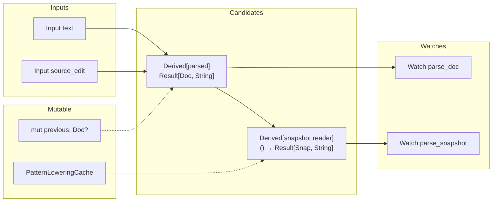
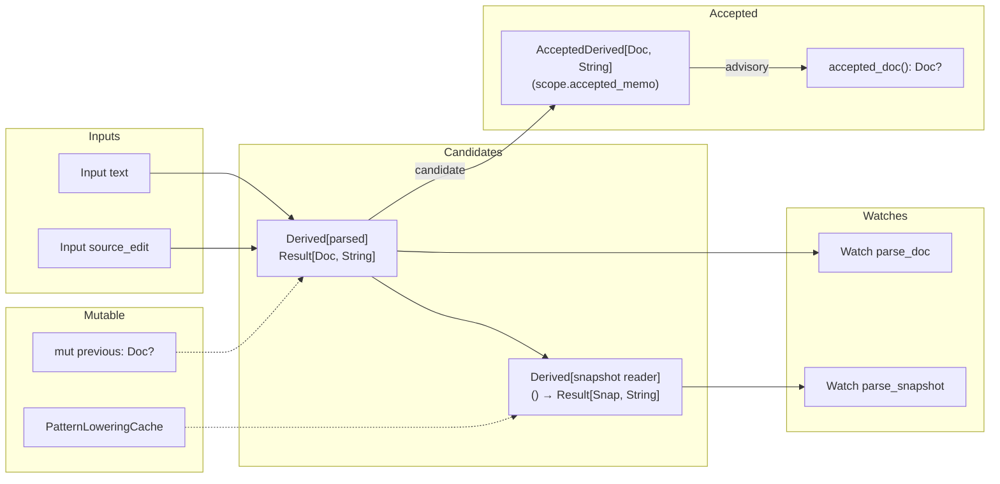

# Mini authoring `AcceptedDerived` migration

**Status:** Completed (2026-07-08; implementation PR #227; decision ADR-0017)  
**Current API refresh:** 2026-09-12; issue #226; incr `0.15.1`
**Date:** 2026-07-07  
**Campaign parent:** #184 (mini authoring loom promotion)  
**Depends on:** incr `#233` (diamond fix), included in current pin `0.15.1`

## Outcome

PR #227 shipped Case A: the current parse channel remains unchanged, a
separate accepted channel retains the last valid document, and parser-local
state remains responsible for stable identity reuse. ADR-0017 records the
accepted decision. The v0.6.0 changelog includes the resulting behavior.

---

## Executive summary

**Decision: Case A — minimum invasiveness (`AcceptedDerived` only,
hand-written authoring parser stays).**

The migration extracted last-good retention into `AcceptedDerived` while
keeping ID reuse in the hand-written authoring parser. It added no dependency
or parser replacement. Its remaining value is as a rehearsal for #184 Phase 4;
the retirement conditions below apply if that campaign chooses a different
acceptance model.

---

## 1. Pre-acceptance architecture (current incr vocabulary)

```text
Input[text] ──┐
Input[edit] ───┤
               v
      Derived[parsed candidate] ──→ Watch[Result[Doc, String]]
               │                     ↑ parse_doc()
               │  mut previous
               │  (last Ok Doc,
               │   UNCHANGED on Err)
               v
      Derived[lazy snapshot reader] ──→ Watch[() -> Result[Snap, String]]
                                        ↑ parse_snapshot()
```


```mermaid
flowchart LR
    subgraph Inputs
        text[Input text]
        edit[Input source_edit]
    end
    subgraph Candidates
        parsed["Derived[parsed]<br/>Result[Doc, String]"]
        snapshot["Derived[snapshot reader]<br/>() → Result[Snap, String]"]
    end
    subgraph Watches
        p_watch[Watch parse_doc]
        s_watch[Watch parse_snapshot]
    end
    subgraph Mutable
        prev["mut previous: Doc?"]
        lc[PatternLoweringCache]
    end
    text --> parsed
    edit --> parsed
    parsed --> snapshot
    prev -.-> parsed
    lc -.-> snapshot
    parsed --> p_watch
    snapshot --> s_watch
```

Key: the parsed derived reads `prev` on every recompute to pass as `previous`
to `parse_doc_with_token_identities`. On `Ok`, it sets `prev = Some(doc)`. On
`Err`, `prev` is untouched. This is two concerns in one mutable cell.

---

## 2. Target architecture (Case A)

```text
Input[text] ──┐
Input[edit] ───┤
               v
      Derived[parsed candidate] ──→ Watch[Result[Doc, String]]
               │                     ↑ parse_doc() — current channel
     ┌─────────┤
     v         │
AcceptedDerived│
  (BackdateEq) │
     │         │
     v         v
  accepted   id-reuse
  channel    previous (kept inside
  (advisory) candidate only)
```


```mermaid
flowchart LR
    subgraph Inputs
        text[Input text]
        edit[Input source_edit]
    end
    subgraph Candidates
        parsed["Derived[parsed]<br/>Result[Doc, String]"]
        snapshot["Derived[snapshot reader]<br/>() → Result[Snap, String]"]
    end
    subgraph Accepted
        ac["AcceptedDerived[Doc, String]<br/>(scope.accepted_memo)"]
        ac_doc["accepted_doc(): Doc?"]
    end
    subgraph Watches
        p_watch[Watch parse_doc]
        s_watch[Watch parse_snapshot]
    end
    subgraph Mutable
        prev["mut previous: Doc?"]
        lc[PatternLoweringCache]
    end
    text --> parsed
    edit --> parsed
    prev -.-> parsed
    parsed --> snapshot
    parsed -->|"candidate"| ac
    parsed --> p_watch
    ac -->|"advisory"| ac_doc
    snapshot --> s_watch
    lc -.-> snapshot
```

Changes:
- `mut previous` stays inside the candidate derived for **ID reuse only** — it
  is still needed by `parse_doc_with_token_identities(..., previous=Some(...))`.
- `AcceptedDerived[PatternDoc, String]` (BackdateEq tier via
  `scope.accepted_memo`) wraps `parsed.read_or_abort()` as its candidate.
- `accepted_doc()` exposes the last-good doc as `PatternDoc?`.
- `parse_doc()` stays the current channel through its persistent `Watch`.
- `parse_snapshot()` stays on the current channel; its watched derived returns
  a per-revision lazy reader so Watch priming does not perform lowering.

---

## 3. Public API diff

| Symbol | Current | After change | Breaking? | Compatibility |
|--------|---------|-------------|-----------|---------------|
| `MiniAuthoringPipeline::parse_doc()` | current channel `Result[Doc, String]` | **unchanged** — still current channel | No | Callers see no change |
| `MiniAuthoringPipeline::parse_snapshot()` | current channel `Result[Snap, String]` | **unchanged** | No | Callers see no change |
| `MiniAuthoringPipeline::accepted_doc()` | **new** | `PatternDoc?` — last-good or `None` | New API | Callers opt in |
| `MiniAuthoringPipeline::new()` | takes `input: String` | **unchanged** | No | — |
| Compute counters | parse_compute/snapshot_compute | **unchanged** semantics | No | — |
| `parse_doc()` after parse error | `Err`, but `previous` unchanged | `Err`, last-good available via `accepted_doc()` | Semantically extended | Compatible: old API still works |

### Key semantic note

`parse_doc()` still returns `Err` on parse failure — callers that only read the current channel see exactly the same behavior. The accepted channel is additive. The "last-good" query was previously invisible (only the next `set_input` + successful parse would see it via ID reuse); now it's first-class.

---

## 4. File change list

| Path | Operation | Summary | Dependencies |
|------|-----------|---------|-------------|
| `mini/incr_authoring.mbt` | Modify | Add `AcceptedDerived` field, wire `scope.accepted_memo()`, add `accepted_doc()` method. `mut previous` stays in the candidate derived for ID reuse. | `mini/moon.pkg` already imports full `@incr` |
| `mini/mini_test.mbt` | Modify | Add tests for `accepted_doc()` channel. Existing tests pass unchanged. | Tests in same file |
| `docs/decisions/0017-mini-authoring-accepted-derived.md` | Add | Record `AcceptedDerived` adoption in the authoring path | Cross-references ADR-0011, ADR-0013 |
| `CHANGELOG.md` | Modify | Add `MiniAuthoringPipeline::accepted_doc()` under [Added] | — |
| `scripts/check-incr-import-boundaries.sh` | Current follow-up | Keep `mini/` as the explicit full-facade carve-out for `Input`, `Derived`, `AcceptedDerived`, and `Watch` ownership. | ADR-0011 |
| `moon.mod` | Current follow-up | incr is now pinned to `0.15.1`; the accepted-channel contract is unchanged. | Issue #226 |

---

## 5. `mut previous` dismantling plan

**Last-good → `AcceptedDerived`:**

```moonbit
// In MiniAuthoringPipeline::new(...), after the parsed derived is constructed:
let accepted = scope.accepted_memo(
  () => parsed.read_or_abort(),
  label="mini.accepted_doc",
)
```

This creates a `BackdateEq`-tier `AcceptedDerived` whose candidate is the parsed derived's current value. `backdate_equal(PatternDoc)` uses full revision identity (value + fingerprint) — the same predicate the spike proved correct.

**ID reuse — stays in candidate:**

`mut previous` remains in the parsed candidate derived body. It is only read by `parse_doc_with_token_identities(..., previous=Some(prev))`. On `Ok`, `previous = Some(doc)`. On `Err`, untouched. This is the ID reuse concern ONLY — the last-good concern is now served by `AcceptedDerived`.

**Ownership:**

```text
candidate derived        AcceptedDerived          mut previous
─────────────────        ───────────────          ───────────
stores previous          stores accepted          inside candidate
for ID reuse             (via incr slot)          body only
                         read-only advisory
```

`source_edit` / token realignment — no change. `previous_source` advances only
after a successful parse.

---

## 6. Test plan

### Existing tests — all pass unchanged

All `MiniAuthoringPipeline` tests exercise the current channel through
`parse_doc()` / `parse_snapshot()`. No assertion changes:

| Test | Behavior | Passes? |
|------|----------|---------|
| `"reuses stable ids and lowering cache across text edits"` | current channel ID stability | Yes, unchanged |
| `"keeps last reusable doc after parse error"` | current channel `Err` + recovery | **Yes** — this test's assertions are about the **current** channel returning `Err` and recovering IDs. It passes unchanged. |
| `"exposes whole-document recomputation counts"` | compute counter behavior | Yes |
| `"token replacement reuses unaffected lowered subtrees"` | cache hit/miss assertion | Yes |
| `"tracks internal authoring token count"` | token counting | Yes |
| All `"source edit preserves..."` tests | provenance assertions | Yes |
| `"accepts Strudel-style dollar stack lines"` | current channel | Yes |

### Key test: `"keeps last reusable doc after parse error"` (line 490)

This test:
1. `s("bd sd")` → success, get IDs
2. `s("bd sd"` → `Err`
3. Recover to `s("  bd   sd  ")`
4. Assert same IDs + lowering cache hit

**Under Case A: pass unchanged.** The test only reads `parse_doc()` and `parse_snapshot()` — the current channel. The `Err` return is unchanged. The recovery IDs come from `mut previous` inside the candidate, which is unchanged. The test never reads the accepted channel, so it doesn't exercise the new `accepted_doc()`.

But: this test **already validates** the last-good behavior implicitly — it proves that `parse_doc()` (current channel) returns `Err` but the next successful parse uses the old IDs. The new `accepted_doc()` exposes that last-good explicitly.

### New tests

From spike `last_good_test.mbt` (port to production):

```moonbit
// 1. accepted_doc retains last good across a parse error
let pipe = MiniAuthoringPipeline::new("s(\"bd sd\")")
let first = unwrap_doc(pipe.parse_doc()).revision()
assert_eq(pipe.accepted_doc().map(d => d.revision()), Some(first))
pipe.set_input("s(\"bd sd")  // malformed
assert(pipe.parse_doc() is Err(_))
assert_eq(pipe.accepted_doc().map(d => d.revision()), Some(first))
pipe.set_input("s(\"bd sd hh\")")  // recovery
let recovered = unwrap_doc(pipe.parse_doc()).revision()
// Collision premise: "bd sd" and "bd sd hh" share revision value but differ by fingerprint
assert_eq(recovered.value(), first.value())
assert_ne(recovered, first)
assert_eq(pipe.accepted_doc().map(d => d.revision()), Some(recovered))

// 2. accepted_doc is None before any successful parse
let pipe2 = MiniAuthoringPipeline::new("s(\"bd sd")
assert(pipe2.parse_doc() is Err(_))
assert_eq(pipe2.accepted_doc(), None)
```

**Revision fingerprint collision test** — ported from spike:

The spike test validates that `BackdateEq` compares by revision **identity** (value + fingerprint), not by revision **value** alone. This is critical because `"bd sd"` and `"bd sd hh"` can collide on revision value (both value=1) but differ by fingerprint. `backdate_equal` must catch this — otherwise a value-only predicate would wrongly treat a changed doc as unchanged and skip the accepted-channel advance.

Assertion template (from spike line 44-55):
```moonbit
// Pin the premise: collision on value, difference by fingerprint
assert_eq(recovered_rev.value(), first_rev.value())
assert_ne(recovered_rev, first_rev)
assert_eq(accepted_revision(pipe), Some(recovered_rev))
```

### Verification commands

```bash
NEW_MOON_MOD=0 moon check --deny-warn
NEW_MOON_MOD=0 moon test --release
./scripts/check-incr-import-boundaries.sh
./scripts/check-public-boundary.sh
```

---

## 7. Phase plan (PRs)

### PR0 — Design document only (this file)

**Files:** `docs/plans/2026-07-07-mini-authoring-accepted-derived-migration.md`  
**Status:** Completed  

### PR1 — `AcceptedDerived` integration (core change)

**Merged as:** PR #227,
`feat(mini): add AcceptedDerived last-good channel to MiniAuthoringPipeline`  
**Scope shipped:** `mini/incr_authoring.mbt`, `mini/mini_test.mbt`

**Changes:**
1. Add `priv accepted : @incr.AcceptedDerived[PatternDoc[ControlMap], String]` field to struct
2. In `MiniAuthoringPipeline::new(...)`, after parsed-derived construction:
   ```moonbit
   let accepted = scope.accepted_memo(
     () => parsed.read_or_abort(),
     label="mini.accepted_doc",
   )
   // No manual root registration: Scope owns the accepted graph and persistent
   // Watch values own outside-graph read roots.
   ```
3. Add `accepted_doc()` method:
   ```moonbit
   pub fn accepted_doc(self) -> PatternDoc[ControlMap]? {
     self.accepted.accepted_or_abort()
   }
   ```
4. Add new tests (port from spike + fingerprint collision)
5. Record the decision in ADR-0017 (completed in the documentation closeout)

**Rollback ease:** Trivial — revert one file. All existing behavior unchanged.  
**Completion criteria:**
- `moon check --deny-warn` passes
- All existing `MiniAuthoringPipeline` tests pass with zero changes
- New `accepted_doc()` tests pass
- Import boundaries pass (`mini/` already on full-facade carve-out list)
- ADR-0017 written

### PR2 — Documentation and CHANGELOG

**Status:** Completed

**Outcome:** The v0.6.0 changelog records the accepted channel, and ADR-0017
records the architectural decision.
**Rollback ease:** Docs only.

---

## 8. Risks and resolved design choices

| Risk | Severity | Mitigation |
|------|----------|------------|
| **`parse_doc()` returns `Err` but `accepted_doc()` returns `Some(doc)`** — caller confusion about which channel to use | Medium | Document clearly: current vs accepted. The pattern is standard incr vocabulary. |
| **`AcceptedDerived` eager fold + dynamic diamond dependency** — incr #233 is included in the current 0.15.1 pin. | None | Already mitigated and covered by production tests. |
| **`accepted_doc()` returns `None` before first successful parse** (not `Err`) | Low | Correct per incr spec. Callers must handle `Option`. |
| **`BackdateEq` tier requires `PatternDoc : BackdateEq`** — already implemented (line 1259 of `pattern/pattern_doc.mbt`) | None | Already satisfied. |

### Resolved design choices

1. **Return shape:** `PatternDoc?`, making the pre-first-success state explicit.
2. **Naming:** `accepted_doc()`, matching the incremental runtime vocabulary.
3. **Revision timestamp:** not exposed; no editor requirement justified it.
4. **Accepted Watch:** not exposed; add a separate accepted-value `Watch` only
   for a concrete editor integration.
5. **Accepted snapshot:** not added; the accepted document is the value
   boundary and lowering already benefits from cache reuse.
6. **Campaign dependency:** retained as a rehearsal for #184 Phase 4. The
   retirement conditions below require removal or redesign if that campaign
   chooses a different acceptance primitive.

---

## 9. Value proposition

This PR's value is not a new capability. It is a rehearsal. `mut previous` already works correctly and no caller in moondsp is waiting for `accepted_doc()`. The purpose is to prove incr `AcceptedDerived` wiring on a simple path before #184 Phase 4 (loom authoring swap) depends on it. If loom swap does not adopt `AcceptedDerived`, this PR is YAGNI.

## 10. Retirement conditions

This change's value depends on **#184 Phase 4 (loom authoring swap) using `AcceptedDerived`**. If any of the following occurs, revert the `AcceptedDerived` introduction (remove `accepted_doc()`, keep `mut previous`) and redesign:

1. **#184 Phase 4 decides not to use `AcceptedDerived`** — if loom swap has its own self-contained last-good (e.g. a separate `mut previous` or loom-managed state), the production-side `AcceptedDerived` becomes unnecessary intermediate state.
2. **Loom authoring swap requires an incompatible acceptance primitive** — if the loom path needs a different acceptance API than `AcceptedDerived`, the production wiring must be redesigned or removed.
3. **incr `AcceptedDerived` receives a breaking change** — if a major version update changes the API, re-evaluate the migration (expected during incr's 0.x phase).
4. **#184 campaign is cancelled** — if loom authoring swap is dropped from the roadmap, the rehearsal value of this PR evaporates (though `accepted_doc()` may be kept if judged independently valuable).

**Retirement decision owner:** moondsp maintainer (@dowdiness). Re-evaluate during loom swap design phase.
---

## 11. ADR and document updates

### New ADR-0017

Status: Accepted (2026-07-08, PR #227). Title: "Mini authoring
AcceptedDerived adoption." The decision records the separation between the
current and accepted channels, keeps parser-local state for identity reuse,
and leaves the Loom authoring promotion gates unchanged.

### ADR-0013 status update

PR #227 does not change ADR-0013's status. The authoring promotion gates
remain open because this migration improves the existing hand-written
authoring path rather than switching it to loom.

### ADR-0011 status

ADR-0011 still reflects the current architecture. Its decision text now notes
that `AcceptedDerived` serves the last-good role while parser-local state
remains responsible for identity reuse.

### `docs/next-actions.md`

The current forward-looking status is maintained in `docs/next-actions.md`;
the completed acceptance decision remains unchanged.

---

## Appendix: Spike proof summary

The `specs/loom-mini-cst/` spike proved the behavior against its local incr
dependency. The equivalent public call shape in incr `0.15.1` is:

```moonbit
// projection.mbt
let accepted = scope.accepted_memo(
  () => projected.read_or_abort(),
  label="loom-mini-atom-projection.accepted",
)
```

Tests in `last_good_test.mbt` verify:
1. First success → `accepted_doc()` returns `Some(first_rev)`
2. Parse error → `parse_doc()` returns `Err`, `accepted_doc()` retains `Some(first_rev)`
3. Recovery to different content → `accepted_doc()` advances (with revision fingerprint collision guard)
4. No success yet → `accepted_doc()` returns `None`

These tests prove the `AcceptedDerived` wiring is correct for `PatternDoc` with `BackdateEq`. The production migration ports only the wiring, not the loom parser or projection.

---

## Appendix: Implementation sketch for `MiniAuthoringPipeline::new`

```moonbit
// Inside `new`, after creating and watching the parsed derived:
let parsed_watch = scope.watch(parsed)
let accepted = scope.accepted_memo(
  () => parsed.read_or_abort(),
  label="mini.accepted_doc",
)

{
  scope,
  text,
  source_edit,
  parsed_watch,
  snapshot_watch,
  token_count_watch,
  lowering_cache,
  parse_compute_count_fn: fn() { parse_compute_count },
  snapshot_compute_count_fn: fn() { snapshot_compute_count },
  accepted,
}
```

`Scope::accepted_memo` owns its internal accepted graph. The parent scope owns
the candidate derived, and persistent `Watch` values root outside-graph reads;
no manual `add_cell_ids` registration is required.

Struct field addition:
```moonbit
priv accepted : @incr.AcceptedDerived[
  @pattern.PatternDoc[@pattern.ControlMap],
  String,
]
```

New method (matches spike `projection.mbt:202-206`):
```moonbit
pub fn MiniAuthoringPipeline::accepted_doc(
  self : MiniAuthoringPipeline,
) -> @pattern.PatternDoc[@pattern.ControlMap]? {
  self.accepted.accepted_or_abort()
}
```

`accepted_or_abort()` returns `V?` directly — aborts on `ReadError`
(Disposed). This is the correct outside-graph accessor (no reactive dep
recorded). The spike uses the same call. Do NOT use `accepted_get()`
(inside-graph, records reactive dependency — wrong for an editor-facing
outside-graph read).

